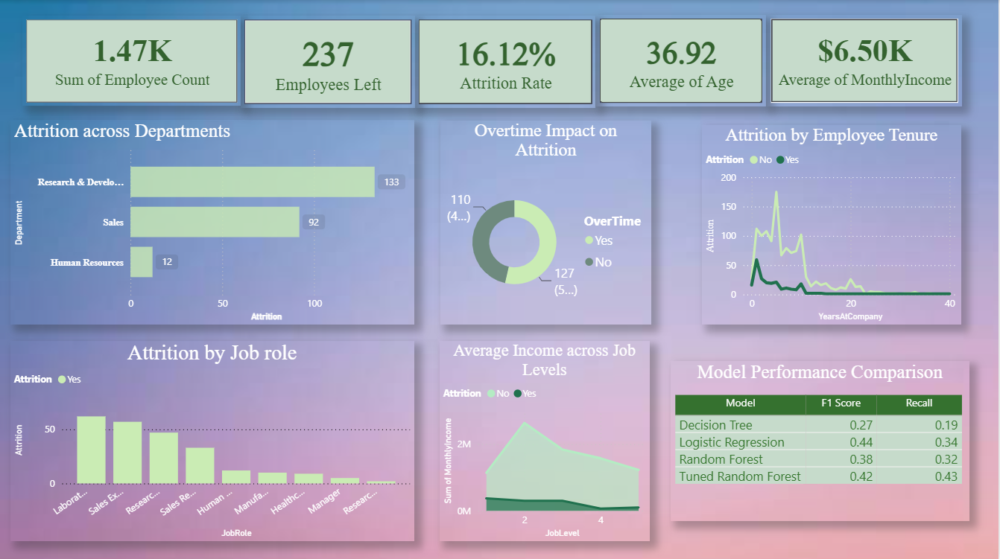

# Employee Attrition Prediction using Machine Learning

## Project Overview

Employee attrition is a major challenge for organizations as it leads to increased recruitment costs, loss of productivity, and knowledge gaps. This project aims to predict employee attrition using machine learning techniques and identify the key factors that contribute to employees leaving an organization.

The project combines exploratory data analysis, feature engineering, machine learning model development, hyperparameter tuning, and business-focused visualization through Power BI.

---

## Objectives

* Analyze employee data to understand attrition patterns.
* Identify the most influential factors affecting employee turnover.
* Build and compare multiple machine learning models.
* Optimize model performance using hyperparameter tuning.
* Create an interactive Power BI dashboard for business insights.

---

## Dataset

The project uses an employee attrition dataset containing information such as:

* Age
* Monthly Income
* Department
* Job Role
* Overtime Status
* Years at Company
* Job Level
* Total Working Years
* Stock Option Level
* Number of Companies Worked
* Attrition Status

---

## Project Workflow

### 1. Data Preprocessing

* Handled categorical variables through encoding.
* Prepared data for machine learning models.
* Split data into training and testing sets.

### 2. Exploratory Data Analysis (EDA)

* Distribution analysis
* Correlation analysis
* Feature importance analysis
* Attrition trend exploration

### 3. Machine Learning Models

The following models were trained and evaluated:

* Logistic Regression
* Decision Tree Classifier
* Random Forest Classifier
* Tuned Random Forest Classifier

### 4. Hyperparameter Tuning

GridSearchCV was used to optimize the Random Forest model by tuning:

* Number of estimators
* Maximum depth
* Minimum samples split
* Minimum samples leaf
* Maximum features

### 5. Model Evaluation

Models were evaluated using:

* Recall Score
* F1 Score
* Accuracy
* Precision

Recall was prioritized to reduce the risk of failing to identify employees likely to leave.

---

## Key Predictive Features

The most influential features identified during analysis included:

1. Monthly Income
2. Age
3. Overtime
4. Years at Company
5. Years with Current Manager
6. Total Working Years
7. Stock Option Level
8. Daily Rate
9. Number of Companies Worked
10. Job Level

---

## Power BI Dashboard

The Power BI dashboard provides business-friendly insights through:

* Employee Overview KPIs
* Attrition Rate Analysis
* Department-wise Attrition
* Job Role Analysis
* Overtime Impact Analysis
* Employee Tenure Analysis
* Income Analysis by Job Level
* Machine Learning Model Comparison

### Dashboard Preview

---

## Results

The Tuned Random Forest model achieved the strongest overall performance and was selected as the final model.

The analysis indicates that factors such as employee income, overtime, job level, and tenure have a significant impact on attrition.

---

## Tools & Technologies

* Python
* Pandas
* NumPy
* Matplotlib
* Seaborn
* Scikit-learn
* Joblib
* Power BI
* Jupyter Notebook

---

## Future Improvements

* Deploy the model using Streamlit or Flask.
* Implement automated model monitoring.
* Incorporate additional employee engagement metrics.
* Explore advanced ensemble learning methods.

---

## Author

Neeraja Rajput

